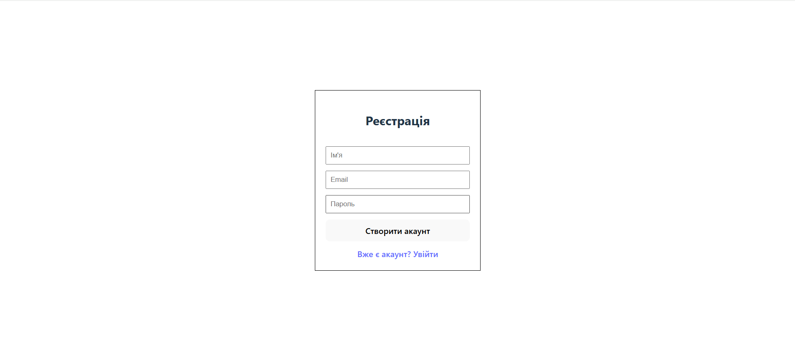
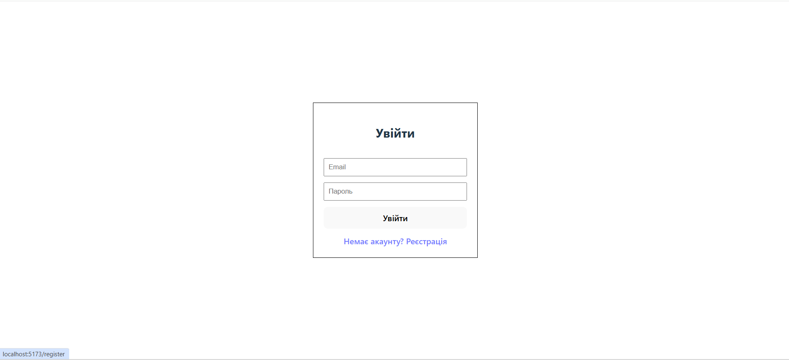
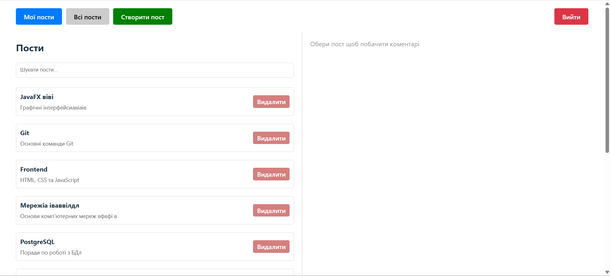
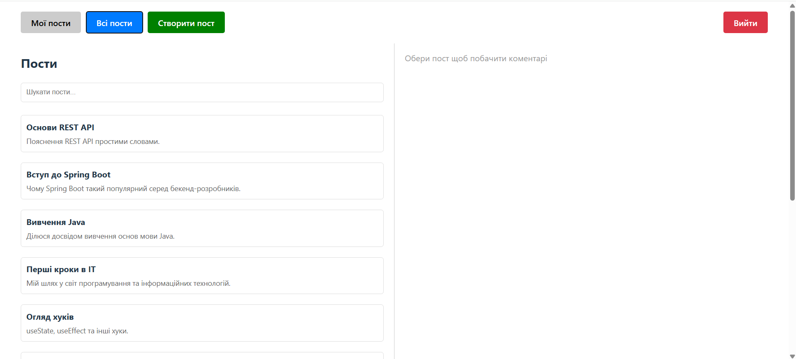
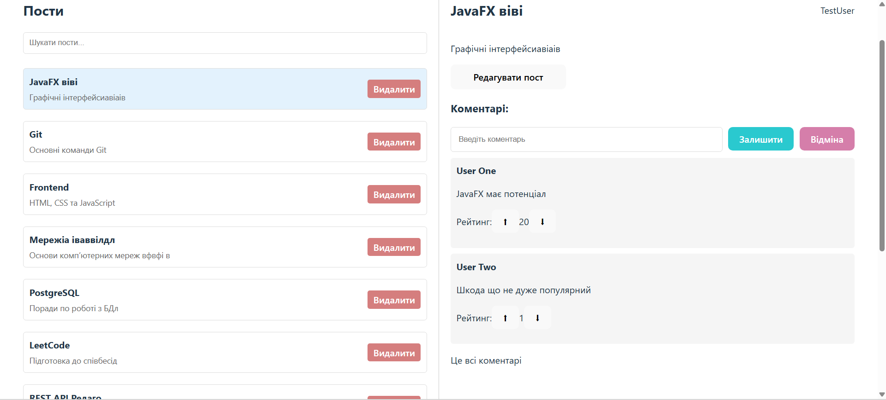
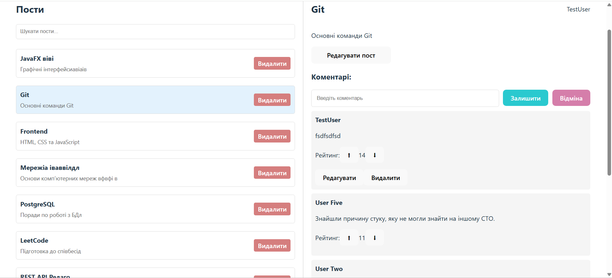
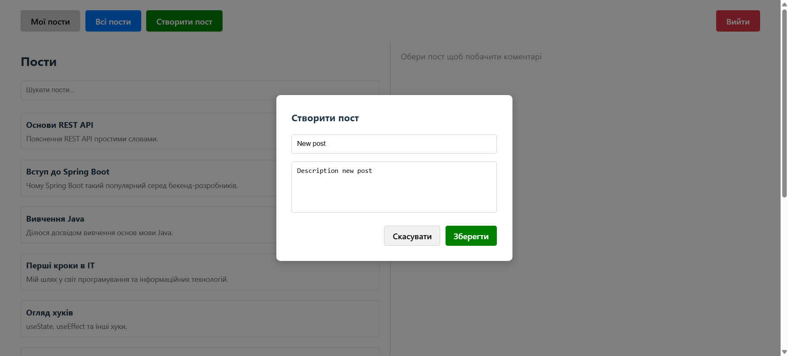
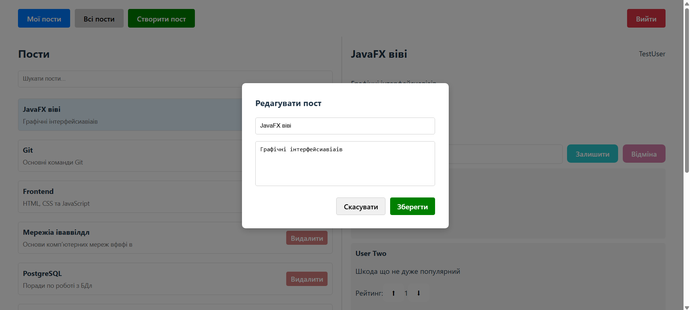
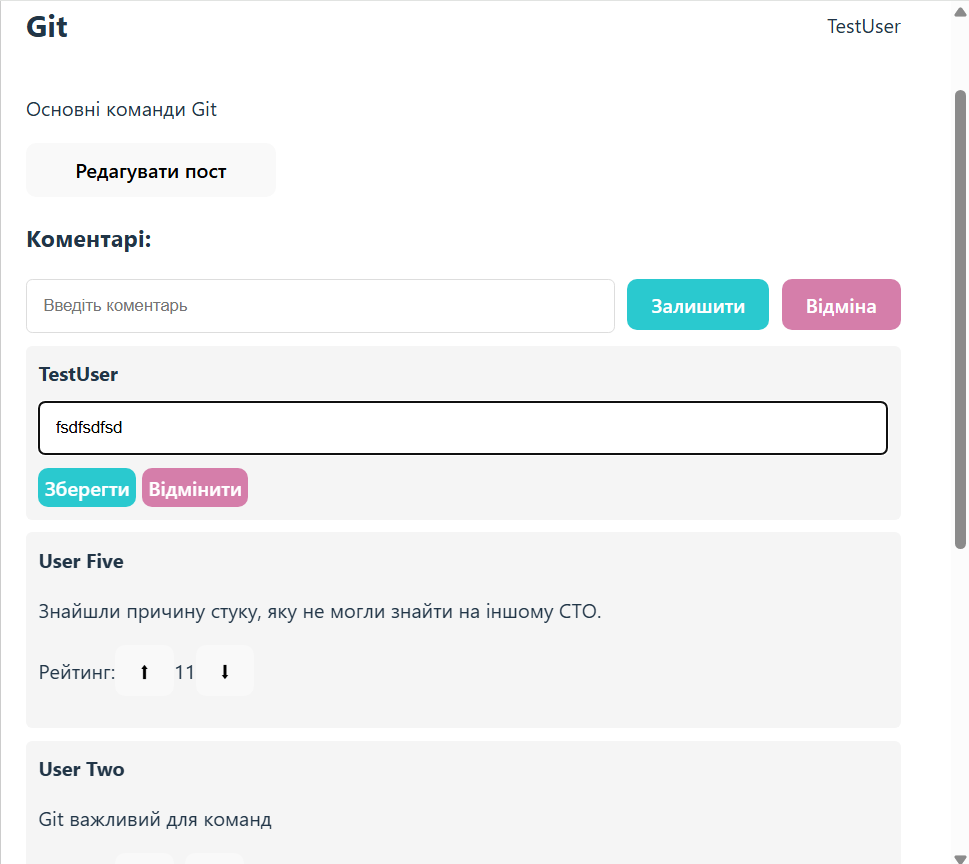
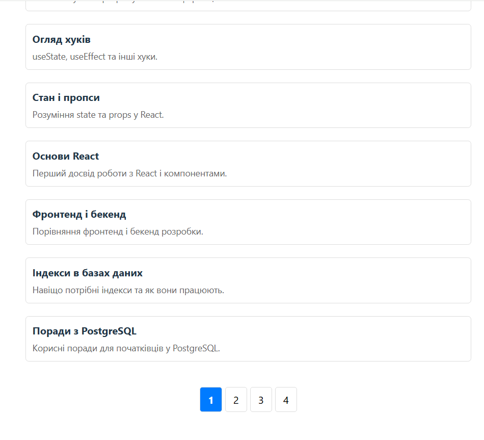

# Full-Stack Blog

Проект розроблений під час проходження виробничої практики в компанії **TRIARE**. Це комплексна система, що поєднує платформу для публікації контенту.

## Технологічний стек
- **Frontend:** React, TypeScript, Axios
- **Backend:** NestJS, TypeScript, TypeORM, PostgreSQL
- **Tools:** JWT, Postman, Git

---

## Реєстрація

## Вхід

## Мої пости

## Всі пости

## Пости

## Створити пост

## Редагувати пост

## Редагувати коментарь

## Пагінація

---

Method,Endpoint,Description,Auth
POST,/auth/register,Реєстрація нового акаунта,❌
POST,/auth/login,Вхід та отримання JWT токена,❌
GET,/auth/profile,Отримання даних поточного користувача,✅
